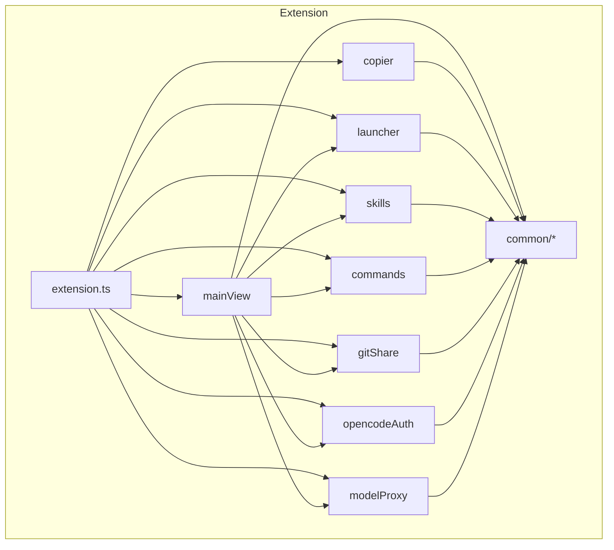
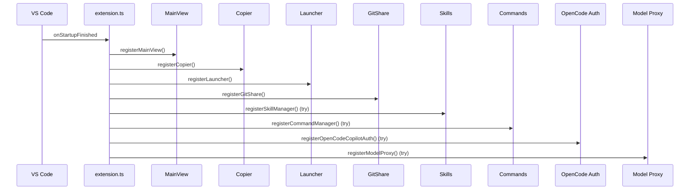
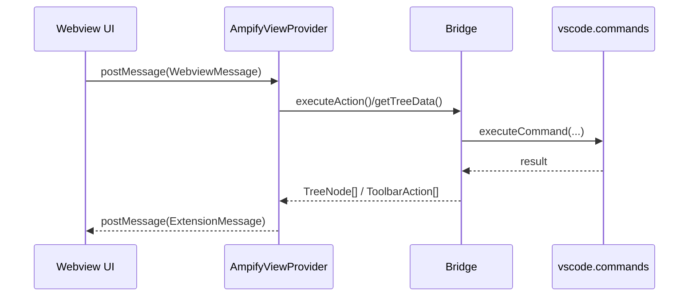
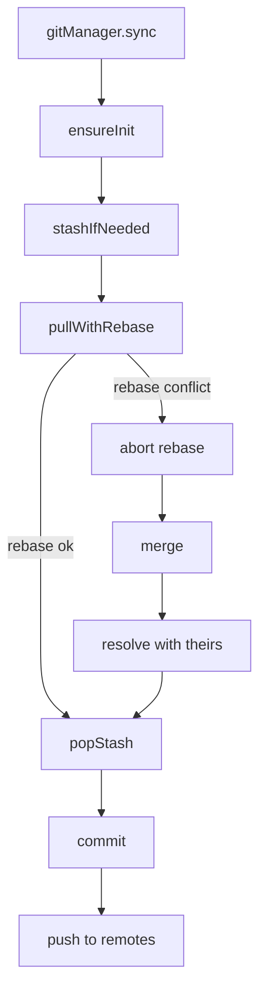
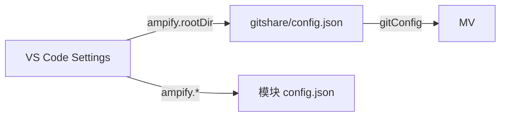

# Ampify 总体架构与数据流

## 目录
- 架构总览
- 扩展激活与注册顺序
- Webview 消息流
- Git Share 同步流程
- 数据存储结构
- 配置层级

## 架构总览



## 扩展激活与注册顺序



## Webview 消息流



补充的 Bridge TreeNode 结构流图请参见：references/module-mainview.md

## Git Share 同步流程



## 数据存储结构

```
~/.vscode-ampify/
├── vscodemultilauncher/
│   ├── config.json
│   ├── userdata/
│   └── shareExtensions/
├── opencode-copilot-auth/
│   └── config.json
├── modelproxy/
│   ├── config.json
│   └── logs/
│       ├── 2026-02-06.jsonl
│       └── ...
└── gitshare/
    ├── .git/
    ├── .gitignore
    ├── config.json
    ├── vscodeskillsmanager/
    │   ├── config.json
    │   └── skills/{skill-name}/SKILL.md
    └── vscodecmdmanager/
        ├── config.json
        └── commands/{command-name}.md
```

## 配置层级



- VS Code Settings 负责 `ampify.*` 配置
- Git Share 配置集中存放于 `gitshare/config.json`
- Skills/Commands 模块配置分别位于 `gitshare/vscodeskillsmanager/config.json` 与 `gitshare/vscodecmdmanager/config.json`
- 其他本地模块配置位于 `~/.vscode-ampify/<module>/config.json`（如 `opencode-copilot-auth`、`modelproxy`）
