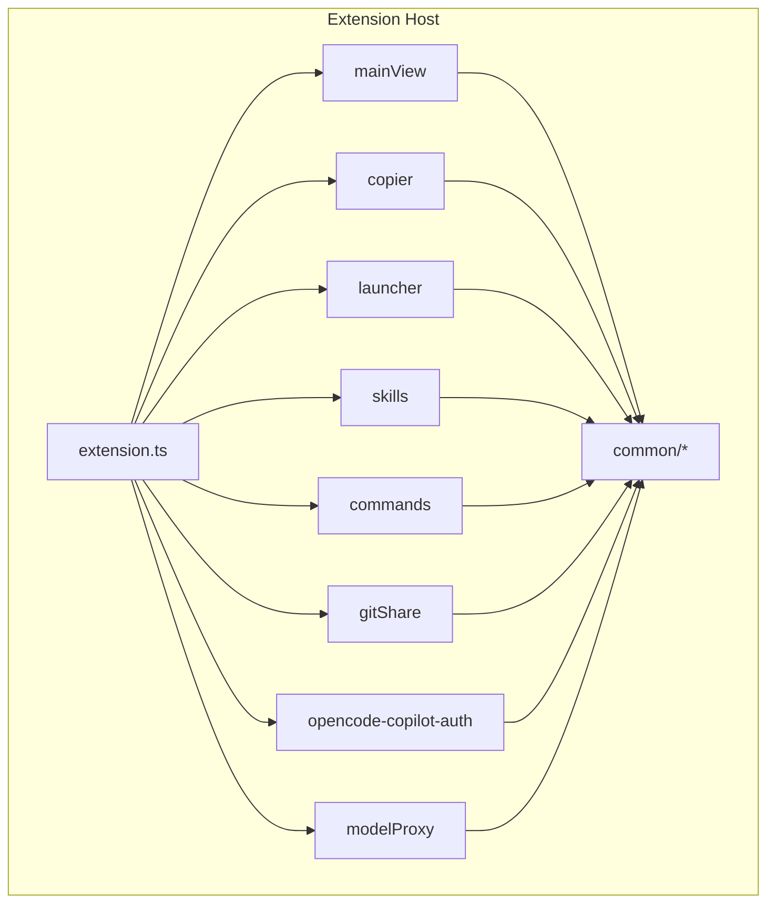
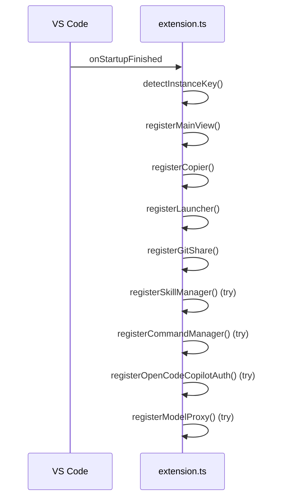
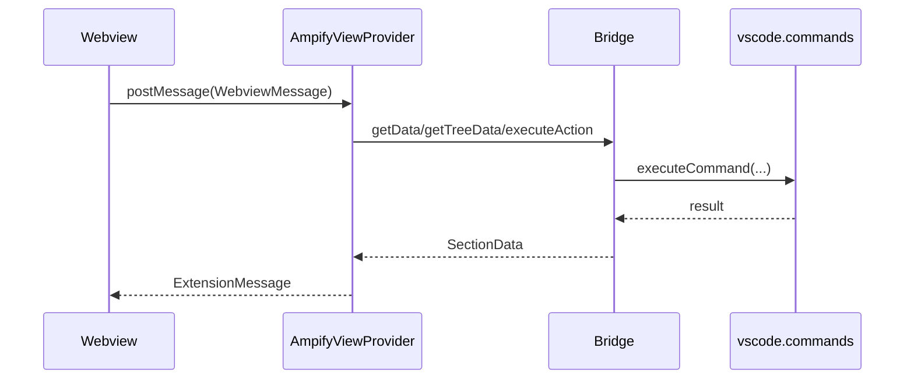
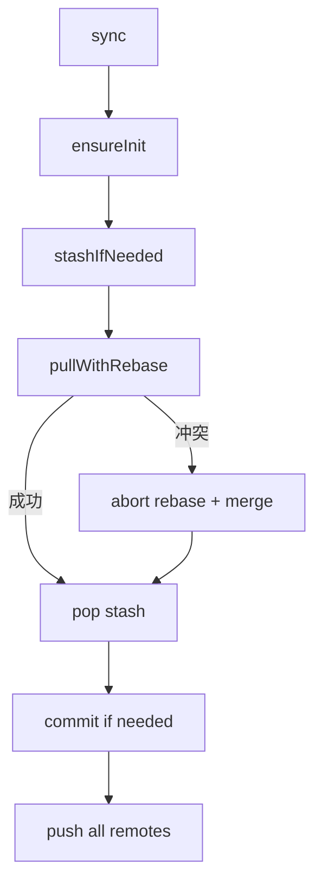

# Ampify 总体架构与数据流

## 架构总览



## 激活与注册顺序



## 实例身份链路（instanceKey）
- Launcher 在目标 `user-data-dir` 写入 `.ampify-instance-key`。
- 扩展激活时 `detectInstanceKey()` 从 `process.argv --user-data-dir` 解析并读取该文件。
- MainView 用该值渲染侧边栏账号徽标；Model Proxy 日志按该值分桶写入 `logs/{instanceKey}/`。

## MainView Section 路由
- 主 section：`dashboard`、`accountCenter`、`skills`、`commands`、`gitshare`、`modelProxy`、`settings`
- 兼容 section：`launcher` / `opencodeAuth` 会被 `AmpifyViewProvider.normalizeSection()` 映射到 `accountCenter`
- `accountCenter` tab：`launcher`、`auth`、`ohmy`、`sessions`

## Webview 消息流



## Git Share 同步主链路



## 数据存储结构

```text
~/.vscode-ampify/
├── vscodemultilauncher/
│   ├── config.json
│   ├── userdata/
│   └── shareExtensions/
├── gitshare/
│   ├── .git/
│   ├── config.json
│   ├── vscodeskillsmanager/
│   │   ├── config.json
│   │   └── skills/{skill-name}/SKILL.md
│   └── vscodecmdmanager/
│       ├── config.json
│       └── commands/{command-name}.md
├── opencode-copilot-auth/
│   └── config.json
└── modelproxy/
    ├── config.json
    └── logs/{instanceKey}/YYYY-MM-DD.jsonl
```

## 配置层级
- VS Code Settings：`ampify.*`（如 `rootDir`、`skills.injectTarget`、`modelProxy.port`）
- Git Share 配置：`~/.vscode-ampify/gitshare/config.json`
- 模块本地配置：`~/.vscode-ampify/<module>/config.json`
