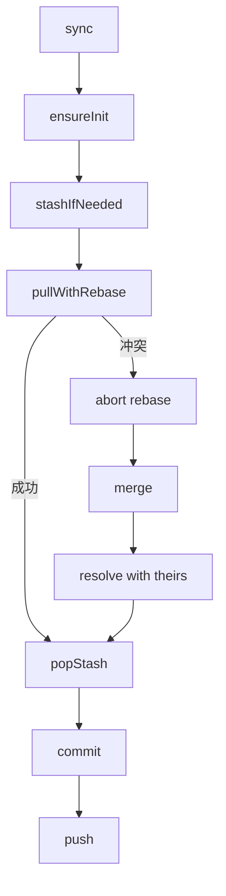

# Git Share 模块

## 模块概述
Git Share 管理 `gitshare/` 仓库的初始化、同步、拉取、提交与推送，并提供差异预览与 Git 配置向导。

## 目录结构
- src/modules/gitShare/index.ts
- src/common/git/gitManager.ts
- src/common/git/diffViewer.ts

## 数据存储
- `~/.vscode-ampify/gitshare/`
  - `.git/`
  - `.gitignore`
  - `config.json`（gitConfig）
  - `vscodeskillsmanager/`
  - `vscodecmdmanager/`

## Git 同步流程

## 关键能力
- 初始化仓库与 `.gitignore`
- 支持多远程仓库（origin, origin-2...）
- 自动检测认证错误并提示配置
- DiffViewer 支持本地变更与远程变更预览

## 配置与刷新
- `config.json` 变更会触发 300ms 防抖刷新
- MainView 在可见时触发自动同步（30s 节流）

## 注册命令
- `ampify.gitShare.refresh`
- `ampify.gitShare.sync`
- `ampify.gitShare.pull`
- `ampify.gitShare.push`
- `ampify.gitShare.commit`
- `ampify.gitShare.showDiff`
- `ampify.gitShare.editConfig`
- `ampify.gitShare.openConfigWizard`
- `ampify.gitShare.openFolder`
