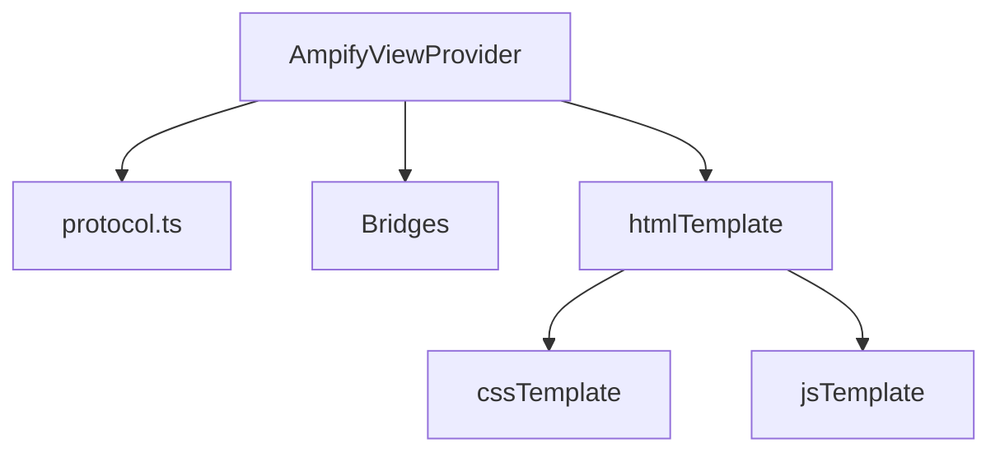
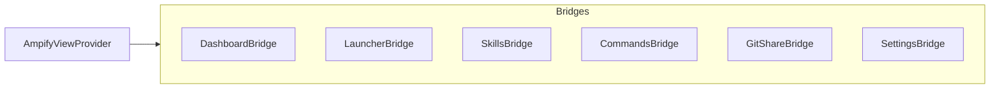

# MainView 模块

## 模块概述
MainView 使用单一 `WebviewViewProvider` 统一渲染 6 个业务模块的视图（dashboard、launcher、skills、commands、gitshare、settings）。TreeView 方案已弃用。

## 目录结构
- src/modules/mainView/index.ts
- src/modules/mainView/AmpifyViewProvider.ts
- src/modules/mainView/protocol.ts
- src/modules/mainView/bridges/*.ts
- src/modules/mainView/templates/*.ts

## 架构关系



## Webview 消息协议
- Webview → Extension：`switchSection`、`executeCommand`、`treeItemClick`、`treeItemAction`、`toolbarAction`、`dropFiles`、`changeSetting`
- Extension → Webview：`updateSection`、`updateDashboard`、`updateSettings`、`showNotification`、`setActiveSection`

## Bridge 设计



- Bridge 输出统一 `TreeNode[]` 与 `ToolbarAction[]`
- `executeAction(actionId, nodeId)` 统一调用命令或内部逻辑
- DashboardBridge 聚合多个模块数据（实例数、skills 数、commands 数、git 状态）

## Bridge 内部 TreeNode 结构流

```mermaid
flowchart TD
    A[模块原始数据] --> B[Bridge.getTreeData()]
    B --> C{是否有过滤条件}
    C -- 是 --> D[过滤/排序/聚合]
    C -- 否 --> E[直接映射]
    D --> F[构建 TreeNode[]]
    E --> F
    F --> G[附加 actions/command/tooltip]
    G --> H[返回 TreeNode[]]
```

## TreeNode 结构示意

```mermaid
flowchart LR
    N[TreeNode]
    N --> ID[id]
    N --> L[label]
    N --> DESC[description]
    N --> ICON[iconId/iconColor]
    N --> COL[collapsible/expanded]
    N --> CHILD[children[]]
    N --> ACT[contextActions/inlineActions]
    N --> CMD[command/commandArgs]
    N --> META[nodeType/tooltip]
```

## 模板职责
- `htmlTemplate.ts`：拼接 HTML、注入 CSP nonce、加载 codicons
- `cssTemplate.ts`：布局样式、导航栏、树节点、表单、上下文菜单
- `jsTemplate.ts`：渲染 Tree、消息分发、状态持久化、拖拽

## 关键行为
- Webview 可见时触发 `gitManager.sync()`（30s 节流）
- `ampify.mainView.refresh` 触发当前 section 刷新

## 注册命令
- `ampify.mainView.refresh`
