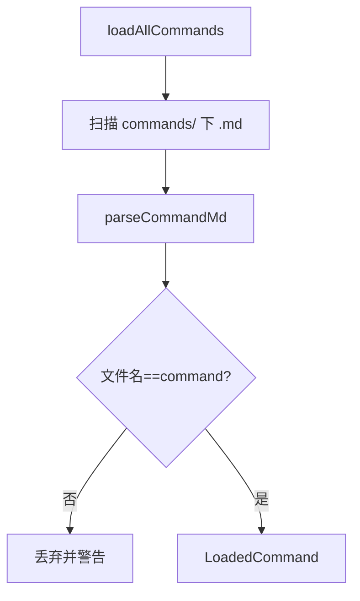

# Commands Manager 模块

## 模块概述
Commands Manager 管理全局命令库，每个命令对应一个 `.md` 文件，使用 frontmatter 描述元数据，并支持导入、创建、应用与移除。

## 目录结构
- src/modules/commands/index.ts
- src/modules/commands/core/commandConfigManager.ts
- src/modules/commands/core/commandCreator.ts
- src/modules/commands/core/commandImporter.ts
- src/modules/commands/core/commandApplier.ts
- src/modules/commands/templates/commandMdTemplate.ts

## 数据存储
- Git Share 目录：`~/.vscode-ampify/gitshare/vscodecmdmanager/`
  - `config.json`
  - `commands/{command-name}.md`

## 关键职责
- `CommandConfigManager`：单例，加载命令列表，验证命令名与文件名一致
- `CommandCreator`：交互式创建 Command
- `CommandImporter`：导入 `.md` 文件，校验 frontmatter
- `CommandApplier`：注入到项目 `.claude/commands/`

## 业务流程

## 注册命令
- `ampify.commands.refresh`
- `ampify.commands.search`
- `ampify.commands.filterByTag`
- `ampify.commands.clearFilter`
- `ampify.commands.create`
- `ampify.commands.import`
- `ampify.commands.apply`
- `ampify.commands.preview`
- `ampify.commands.open`
- `ampify.commands.openFolder`
- `ampify.commands.delete`
- `ampify.commands.remove`

## 与 MainView 的交互
- CommandsBridge 负责 TreeNode 适配与过滤状态
- 拖拽导入由 Webview drop 事件触发

## 注意点
- 命令名校验规则：小写字母/数字/连字符，长度 1-64
- Commands Manager 不继承 `BaseConfigManager`，其配置与数据均存放在 Git Share 目录，便于同步
