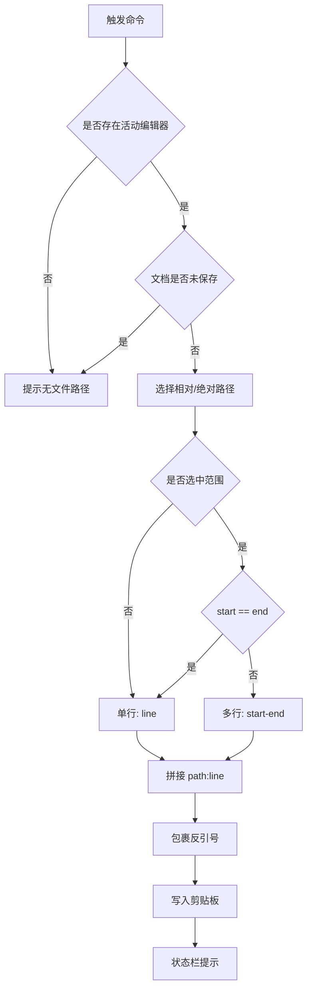

# Copier 模块

## 模块概述
Copier 提供“复制路径 + 行号”的快捷功能，支持相对路径与绝对路径两种输出，结果统一包裹反引号，适配 Markdown 引用场景。

## 目录结构
- src/modules/copier/index.ts

## 核心逻辑
- `buildReference(useRelativePath)`：组装 `path:line` 输出
- `getRelativePath(doc)`：获取工作区相对路径，缺失工作区时回退绝对路径
- `showMessage(msg)`：状态栏提示

## 业务流程

## 注册命令
- `ampify.copy-relative-path-line`
- `ampify.copy-absolute-path-line`

## 相关配置
- 无独立配置

## 依赖与交互
- 依赖 `I18n` 提示文案
- 直接使用 VS Code Clipboard API
