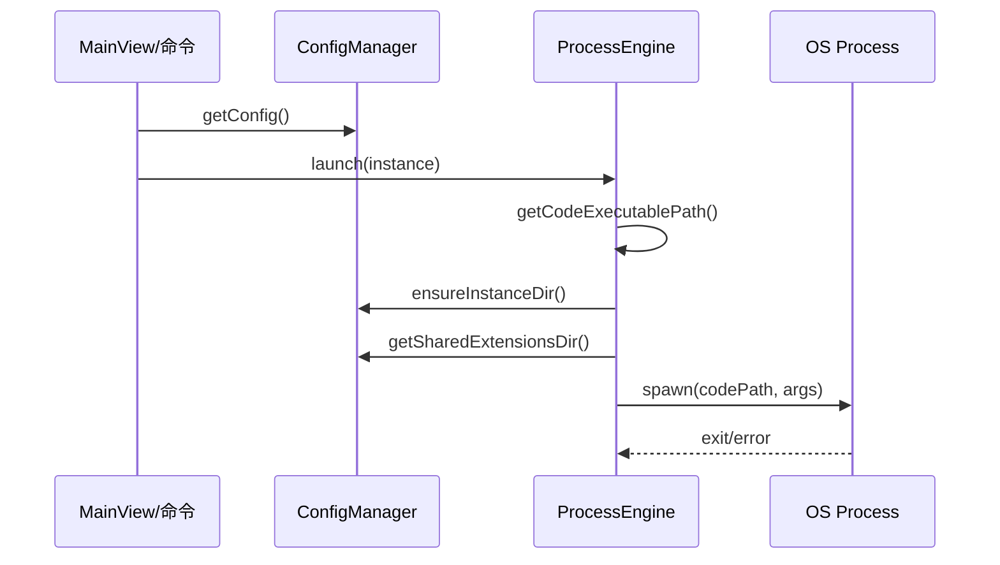

# Launcher 模块

## 模块概述
Launcher 负责多实例启动器。它管理多个用户配置（user data）与共享扩展目录，并通过 `ProcessEngine` 启动新实例。

## 目录结构
- src/modules/launcher/index.ts
- src/modules/launcher/core/configManager.ts
- src/modules/launcher/core/processEngine.ts

## 核心类与职责
- `ConfigManager`：继承 `BaseConfigManager<LauncherConfig>`，管理 `vscodemultilauncher/config.json` 与 `userdata/`、`shareExtensions/`
- `ProcessEngine`：解析 VS Code 可执行路径，组装参数并 spawn 新进程

## 业务流程

## 关键实现细节
- Windows 优先寻找 `code.cmd`，失败后回退 `Code.exe` 或 `process.execPath`
- 注入参数：`--user-data-dir`、`--extensions-dir` + 实例自定义 `vscodeArgs`
- 优先使用当前工作区作为启动参数，缺失时使用 `defaultProject`
- `ELECTRON_RUN_AS_NODE` 被显式移除，避免子进程异常

## 数据存储
- `~/.vscode-ampify/vscodemultilauncher/`
  - `config.json`
  - `userdata/`
  - `shareExtensions/`

## 注册命令
- `ampify.launcher.add`
- `ampify.launcher.refresh`
- `ampify.launcher.editConfig`
- `ampify.launcher.launch`
- `ampify.launcher.delete`

## 依赖与交互
- 通过 MainView Bridge 展示实例列表
- 使用 `I18n` 提示输入与错误信息
