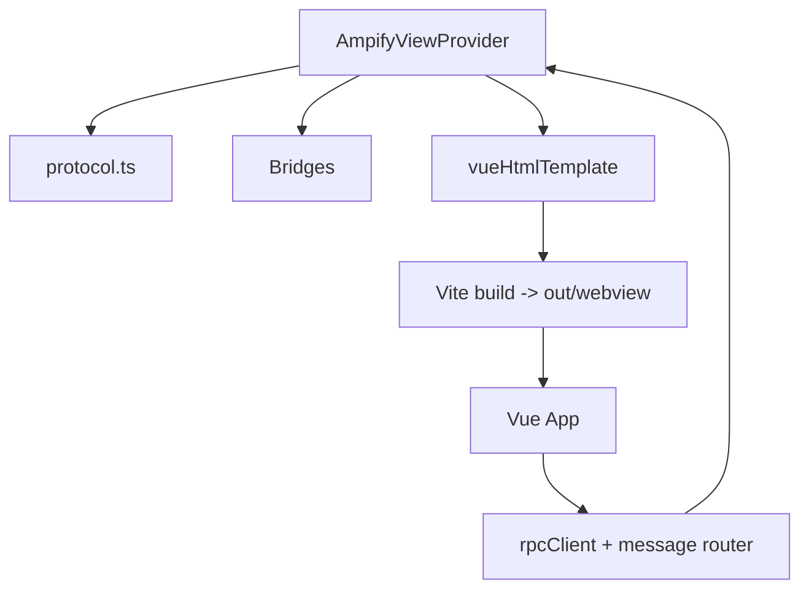
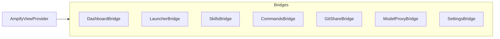

# MainView 模块（Vue Webview）

## 模块概述
MainView 使用单一 `WebviewViewProvider` 统一渲染 7 个业务模块（dashboard、launcher、skills、commands、gitshare、modelProxy、settings）。Webview 采用 Vue 3 + Vite + Pinia + Element Plus 架构，Extension Host 仅负责数据桥接与消息处理，所有 UI 渲染在 webview 内完成。

## 目录结构
- src/modules/mainView/index.ts
- src/modules/mainView/AmpifyViewProvider.ts
- src/modules/mainView/protocol.ts
- src/modules/mainView/bridges/*.ts
- src/modules/mainView/templates/vueHtmlTemplate.ts
- webview/
  - src/main.ts
  - src/App.vue
  - src/components/**
  - src/stores/**
  - src/composables/useMessageRouter.ts
  - src/utils/{rpcClient,vscodeApi}.ts
  - src/styles/**
  - src/types/protocol.ts

## 架构关系



## Vue 构建与运行时加载

### Vite 构建流程
- 入口：webview/src/main.ts
- 构建输出：out/webview/index.html + out/webview/assets/index.js (+ style.css)
- Vite 配置：单 chunk（inlineDynamicImports）、CSP 友好（esbuild minify, no eval）
- Element Plus：通过 unplugin-auto-import + unplugin-vue-components 按需引入

### Extension Host 加载逻辑
入口：src/modules/mainView/templates/vueHtmlTemplate.ts

步骤：
1. 读取 out/webview/index.html
2. 将 /assets/* 替换为 webview.asWebviewUri() 可访问路径
3. 注入 CSP meta（script/style 使用 nonce）
4. 注入 codicon.css
5. 注入 window.__AMPIFY_INIT__（activeSection, instanceKey）

回退逻辑：如构建产物不存在，展示提示页面并提示 `npm run compile:webview`。

### Webview 初始化流程
入口：webview/src/main.ts

1. 初始化 rpcClient 消息监听
2. mount Vue App
3. 读取 window.__AMPIFY_INIT__ 恢复 activeSection + instanceKey
4. 发送 `{ type: 'ready' }` 通知 Extension Host

## Webview ↔ Extension 交互协议
协议定义：
- Extension 侧：src/modules/mainView/protocol.ts
- Webview 侧：webview/src/types/protocol.ts

当前兼容两套机制：
- Legacy 消息：`{ type: 'xxx' }` 直接 postMessage
- RPC 消息：`{ type: 'request' | 'response' | 'event' }`

### Webview → Extension（Legacy）
- `switchSection`
- `executeCommand`
- `treeItemClick`
- `treeItemAction`
- `toolbarAction`
- `dropFiles`
- `changeSetting`
- `settingsAction`
- `quickAction`
- `overlaySubmit` / `overlayCancel`
- `confirmResult`
- `filterByKeyword` / `filterByTags` / `clearFilter` / `toggleTag`
- `selectProxyModel`
- `proxyAction`
- `requestLogFiles`
- `queryLogs`

### Extension → Webview（Legacy）
- `updateDashboard`
- `updateSection`
- `setActiveSection`
- `updateSettings`
- `updateModelProxy`
- `updateLogFiles`
- `updateLogQuery`
- `showOverlay` / `hideOverlay`
- `showConfirm`
- `showNotification`

### RPC 使用方式（可选）
- Webview：rpcClient.request(method, params)
- Extension：返回 `{ type: 'response', id, result | error }`
- 当前仍以 legacy 为主，RPC 用于未来扩展

## 消息路由与状态管理

### Webview 侧
- rpcClient：封装 postMessage + request/response
- useMessageRouter：把 Extension 消息路由到 Pinia stores
- Pinia stores：
  - appStore：导航状态 + VS Code state 持久化
  - dashboardStore：Dashboard 数据
  - sectionStore（launcher/skills/commands/gitshare）：TreeNode + Toolbar + Tag 过滤
  - modelProxyStore：Proxy dashboard + logs
  - settingsStore：Settings 数据 + 更新操作
  - overlayStore：Overlay/Confirm 状态

### Extension 侧
- AmpifyViewProvider：
  - 管理 Webview 生命周期
  - 处理所有 Webview 消息
  - 调用各 Bridge 获取数据
  - 下发 updateSection/updateDashboard 等消息
- Bridges：负责将模块数据转为 TreeNode[] + ToolbarAction[]

## Bridge 设计



- Bridge 输出统一 `TreeNode[]` 与 `ToolbarAction[]`
- `executeAction(actionId, nodeId)` 统一封装命令或内部逻辑
- DashboardBridge 聚合多个模块统计数据

## TreeNode 结构示意

```mermaid
flowchart LR
    N[TreeNode]
    N --> ID[id]
    N --> L[label]
    N --> DESC[description]
    N --> ICON[iconId/iconColor]
    N --> COL[collapsible/expanded]
    N --> CHILD[children[]]
    N --> ACT[contextActions/inlineActions]
    N --> CMD[command/commandArgs]
    N --> META[nodeType/tooltip]
```

## 关键行为
- Webview 可见时触发 git 自动同步（30s 节流）
- `ampify.mainView.refresh` 触发当前 section 刷新
- modelProxy section 分两步发送：
  1) `updateSection` 仅包含 toolbar
  2) `updateModelProxy` 发送 dashboard 数据

## 开发与构建命令
- `npm run compile`：Extension + Webview 全量编译
- `npm run compile:webview`：仅构建 Webview
- `npm run dev:webview`：Vite dev server（仅前端调试）
- `npm run watch:webview`：Webview build watch

## 开发注意事项
- Webview 侧全部开发在 webview/ 内完成
- 不再使用旧模板（htmlTemplate/cssTemplate/jsTemplate 已移除）
- Webview 内无需直接访问 vscode API，请通过 rpcClient 发送消息
- 所有与 Extension 的交互都必须在 protocol.ts 中定义类型
