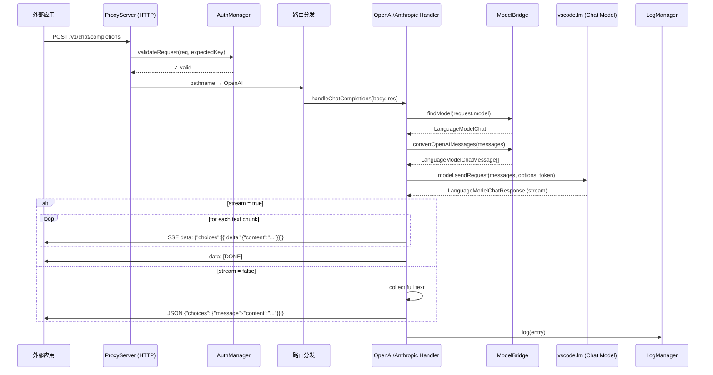
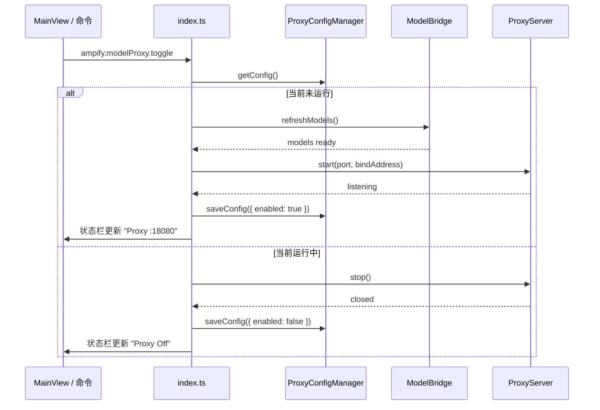

# Model Proxy 模块

## 模块概述
Model Proxy 利用 VS Code `vscode.lm` API 获取 Copilot Chat 可用模型，在本地启动 HTTP 反代理服务器，同时暴露 **OpenAI** 兼容路由 (`/v1/chat/completions`) 和 **Anthropic** 兼容路由 (`/v1/messages`)。外部应用通过 `BaseUrl + API Key` 即可直接调用 VS Code 内的 LLM 能力。

### 核心能力
- 一键开启/关闭本地代理（MainView + 状态栏 + 命令）
- OpenAI & Anthropic 双格式兼容（单端口双路由）
- 自动生成 API Key，支持查看/复制/重新生成
- 流式 (SSE) 与非流式响应
- 自动模型发现与路由
- JSONL 按日期分割请求日志

## 目录结构
```
src/modules/modelProxy/
├── index.ts                        # registerModelProxy(context) 入口
└── core/
    ├── proxyConfigManager.ts       # 配置管理（单例）
    ├── proxyServer.ts              # HTTP 服务器生命周期
    ├── modelBridge.ts              # VS Code LM ↔ 外部 API 消息转换
    ├── openaiHandler.ts            # OpenAI 格式请求/响应处理
    ├── anthropicHandler.ts         # Anthropic 格式请求/响应处理
    ├── authManager.ts              # API Key 生成/提取/验证
    └── logManager.ts               # JSONL 日志管理
```

## 核心类与职责

| 类 | 职责 |
|---|---|
| `ProxyConfigManager` | 单例。管理 `modelproxy/config.json`（端口、Key、启用状态、默认模型、日志开关）。端口/绑定地址优先读取 VS Code Settings |
| `AuthManager` | 静态工具类。`generateKey()` 生成 `amp-<64hex>` 格式 Key；`extractKey()` 从 `Authorization: Bearer` 或 `x-api-key` 提取；`validateRequest()` 使用 `timingSafeEqual` 防时序攻击 |
| `ModelBridge` | 管理模型缓存（`Map<id, LanguageModelChat>`）、模型查找（精确→family→模糊）、消息格式转换、token 估算。监听 `onDidChangeChatModels` 自动刷新 |
| `OpenAIHandler` | 处理 `POST /v1/chat/completions`（流式/非流式）和 `GET /v1/models`。流式输出 SSE `data: {...}\n\n` + `data: [DONE]` |
| `AnthropicHandler` | 处理 `POST /v1/messages`。流式输出 `event: message_start` → `content_block_delta` → `message_stop` |
| `ProxyServer` | Node.js `http.createServer`。路由分发、CORS、认证中间件、请求体限制 (1MB)、`/health` 端点 |
| `LogManager` | JSONL 日志写入 `~/.vscode-ampify/modelproxy/logs/YYYY-MM-DD.jsonl`。提供 `getRecentLogs()` 和 `getTodayStats()` |

## VS Code API 依赖

| API | 用途 |
|---|---|
| `vscode.lm.selectChatModels(selector?)` | 枚举可用模型列表 |
| `vscode.lm.onDidChangeChatModels` | 监听模型变化，刷新缓存 |
| `LanguageModelChat.sendRequest(messages, options, token)` | 向模型发送请求 |
| `LanguageModelChatResponse.stream` / `.text` | 流式读取响应 |
| `LanguageModelChatMessage.User()` / `.Assistant()` | 构造消息 |
| `LanguageModelChat.countTokens()` | token 估算 |
| `LanguageModelChatRequestOptions.modelOptions` | 透传 temperature 等参数 |
| `vscode.CancellationTokenSource` | 客户端断开时取消请求 |
| `vscode.LanguageModelError` | 捕获权限/找不到模型等错误 |

## 业务流程

### 代理请求数据流



### 代理启动/关闭流程



## HTTP 路由表

| 方法 | 路径 | 认证 | 处理器 | 说明 |
|---|---|---|---|---|
| `GET` | `/health` | 否 | ProxyServer | 健康检查 |
| `GET` | `/v1/models` | 是 | OpenAIHandler | 模型列表（OpenAI 格式） |
| `POST` | `/v1/chat/completions` | 是 | OpenAIHandler | 聊天补全（支持 stream） |
| `POST` | `/v1/messages` | 是 | AnthropicHandler | 消息 API（支持 stream） |
| `OPTIONS` | `*` | 否 | ProxyServer | CORS 预检 |

## 认证方式
支持两种头部（自动识别）：
- `Authorization: Bearer amp-xxxx...` (OpenAI 风格)
- `x-api-key: amp-xxxx...` (Anthropic 风格)

Key 格式：`amp-` + 64 位随机 hex（`crypto.randomBytes(32)`）

## 模型匹配策略
外部请求的 `model` 字段按优先级匹配：
1. **精确匹配** `model.id`
2. **family 匹配** `model.family`（如 `gpt-4o`）
3. **模糊匹配** id/family/name 包含请求字符串
4. **兜底** 使用第一个可用模型

## 消息格式转换

### OpenAI → VS Code
| OpenAI role | VS Code |
|---|---|
| `system` | `LanguageModelChatMessage.User()` |
| `user` | `LanguageModelChatMessage.User()` |
| `assistant` | `LanguageModelChatMessage.Assistant()` |
| `tool` | `LanguageModelChatMessage.User()` |

### Anthropic → VS Code
- `system` 参数 → 第一条 `User` 消息
- `user` / `assistant` → 对应 `User()` / `Assistant()`
- Content blocks 展平为纯文本

## 命令注册

| 命令 ID | 说明 |
|---|---|
| `ampify.modelProxy.toggle` | 切换代理开/关 |
| `ampify.modelProxy.start` | 启动代理 |
| `ampify.modelProxy.stop` | 停止代理 |
| `ampify.modelProxy.copyKey` | 复制 API Key |
| `ampify.modelProxy.regenerateKey` | 重新生成 Key |
| `ampify.modelProxy.copyBaseUrl` | 复制 Base URL |
| `ampify.modelProxy.selectModel` | 选择默认模型（QuickPick） |
| `ampify.modelProxy.viewLogs` | 打开日志文件夹 |
| `ampify.modelProxy.refresh` | 刷新模型列表 |

## VS Code Settings

| 配置项 | 类型 | 默认值 | 说明 |
|---|---|---|---|
| `ampify.modelProxy.port` | `number` | `18080` | HTTP 服务端口 |
| `ampify.modelProxy.bindAddress` | `string` | `127.0.0.1` | 绑定地址 |

> `apiKey`、`enabled`、`defaultModelId`、`logEnabled` 存储在模块本地 `config.json`，而非 VS Code Settings（敏感数据/运行时状态）。

## 数据存储

```
~/.vscode-ampify/
└── modelproxy/
    ├── config.json          # ProxyConfig
    └── logs/
        ├── 2026-02-06.jsonl
        └── ...
```

### ProxyConfig 结构
```json
{
  "port": 18080,
  "apiKey": "amp-a1b2c3d4...",
  "enabled": false,
  "defaultModelId": "",
  "logEnabled": true,
  "bindAddress": "127.0.0.1"
}
```

### 日志条目（JSONL 每行）
```json
{
  "timestamp": "2026-02-06T14:23:05.123Z",
  "requestId": "550e8400-e29b-41d4-a716-446655440000",
  "format": "openai",
  "model": "gpt-4o",
  "inputTokens": 128,
  "outputTokens": 256,
  "durationMs": 1234,
  "status": "success"
}
```

## MainView Bridge

### TreeNode 结构
```
📡 Model Proxy: 运行中 :18080        [Start/Stop]
🔗 地址: http://127.0.0.1:18080       [Copy]
🔑 API Key: amp-a1b2...xxxx           [Copy] [Regenerate]
🤖 默认模型: GPT-4o (2 available)     [Change]
📊 今日统计: 5 次请求 · 3200 tokens
📋 最近日志 (可展开)
  ├── 14:23:05  openai gpt-4o 1.2s ✓
  ├── 14:22:58  anthropic claude-3 0.8s ✓
  └── 14:22:31  openai gpt-4o 2.1s ✗
```

### Toolbar
- Toggle (Start/Stop)
- Refresh
- Open Logs

## 外部调用示例

### OpenAI 格式
```bash
curl http://127.0.0.1:18080/v1/chat/completions \
  -H "Authorization: Bearer amp-xxxxx" \
  -H "Content-Type: application/json" \
  -d '{"model":"gpt-4o","messages":[{"role":"user","content":"Hello"}],"stream":true}'
```

### Anthropic 格式
```bash
curl http://127.0.0.1:18080/v1/messages \
  -H "x-api-key: amp-xxxxx" \
  -H "Content-Type: application/json" \
  -d '{"model":"claude-sonnet-4-20250514","messages":[{"role":"user","content":"Hello"}],"max_tokens":1024}'
```

### 模型列表
```bash
curl http://127.0.0.1:18080/v1/models \
  -H "Authorization: Bearer amp-xxxxx"
```

## 安全注意事项
- 默认仅绑定 `127.0.0.1`，外部访问需显式配置 `0.0.0.0`
- API Key 使用 `crypto.timingSafeEqual` 验证，防止时序攻击
- 请求体限制 1MB
- 客户端断开时通过 `CancellationToken` 取消 VS Code 请求
- Key 存储在本地 `config.json`，不进入 VS Code Settings 同步

## 关键约束
- `LanguageModelChat.sendRequest()` 首次调用时 VS Code 会弹出用户授权对话框
- 使用 Node.js 内置 `http` 模块，无需额外依赖
- `deactivate()` 时通过 context subscriptions 自动调用 `proxyServer.stop()` 和 `modelBridge.dispose()`
