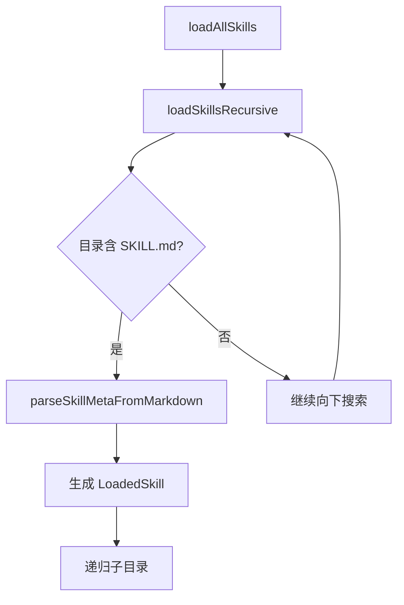

# Skills Manager 模块

## 模块概述
Skills Manager 管理全局 Skills 库，解析 `SKILL.md` frontmatter，并支持创建、导入、应用到项目以及同步 `AGENTS.md`。

## 目录结构
- src/modules/skills/index.ts
- src/modules/skills/core/skillConfigManager.ts
- src/modules/skills/core/skillCreator.ts
- src/modules/skills/core/skillImporter.ts
- src/modules/skills/core/skillApplier.ts
- src/modules/skills/core/agentMdManager.ts
- src/modules/skills/templates/skillMdTemplate.ts

## 数据存储
- Git Share 目录：`~/.vscode-ampify/gitshare/vscodeskillsmanager/`
  - `config.json`
  - `skills/{skill-name}/SKILL.md`

## 关键职责
- `SkillConfigManager`：单例，读取/保存配置，递归扫描 Skills 目录，解析 frontmatter
- `SkillCreator`：交互式创建 Skill 目录与 SKILL.md
- `SkillImporter`：导入已有 Skill 目录，验证名称与 frontmatter
- `SkillApplier`：注入 Skill 到项目 `.claude/skills/`
- `AgentMdManager`：扫描注入目录，生成 `.claude/SKILLS.md`，更新 `AGENTS.md`

## 解析与扫描逻辑



## Skill 应用流程

```mermaid
flowchart TD
    A[apply(skill)] --> B[检查工作区]
    B --> C[检查前置依赖]
    C -- 失败 --> D[提示并终止]
    C -- 通过 --> E[复制到 injectTarget]
    E --> F[AgentMdManager.scanAndSync]
    F --> G[提示成功]
```

## 注册命令
- `ampify.skills.refresh`
- `ampify.skills.search`
- `ampify.skills.filterByTag`
- `ampify.skills.clearFilter`
- `ampify.skills.create`
- `ampify.skills.import`
- `ampify.skills.importFromUris`
- `ampify.skills.apply`
- `ampify.skills.preview`
- `ampify.skills.openFile`
- `ampify.skills.openFolder`
- `ampify.skills.delete`
- `ampify.skills.remove`
- `ampify.skills.syncToAgentMd`

## 与 MainView 的交互
- SkillsBridge 负责 TreeNode 适配与过滤状态
- 搜索与标签过滤状态由 Bridge 持有，命令仅触发刷新

## 注意点
- Skills Manager 不继承 `BaseConfigManager`，其配置与数据均存放在 Git Share 目录，便于跨机器同步
- `allowedTools` 与 `allowed-tools` 同时兼容
