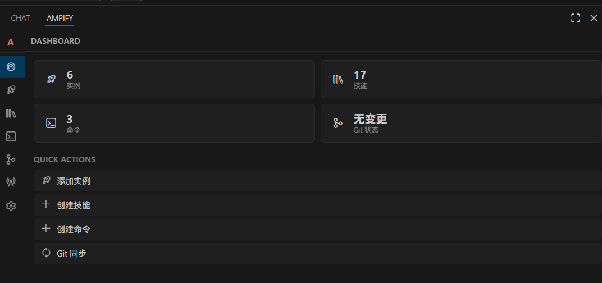
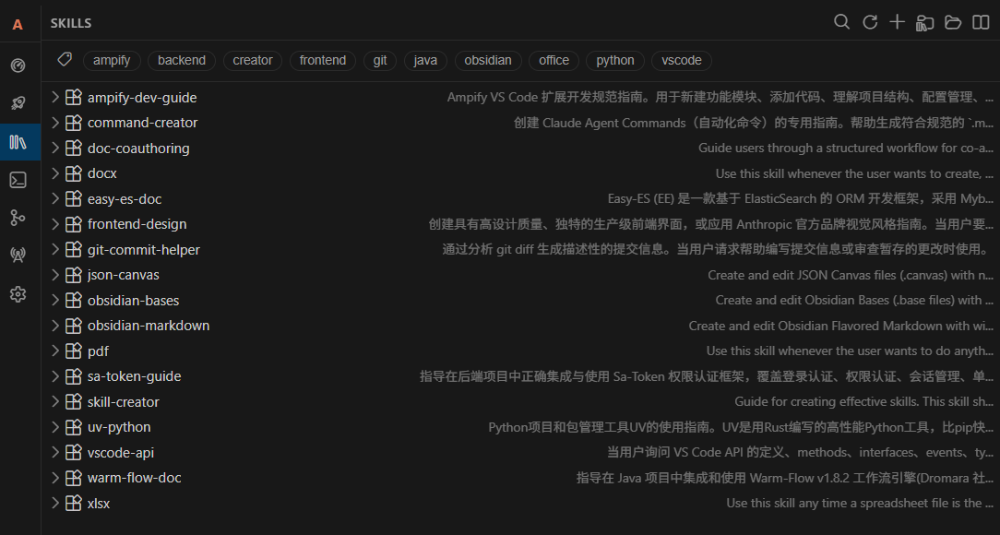
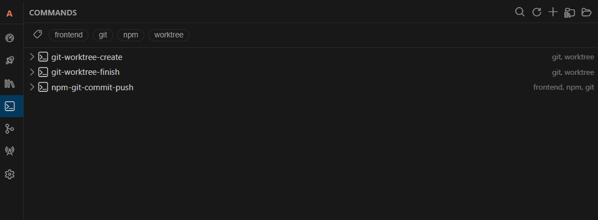
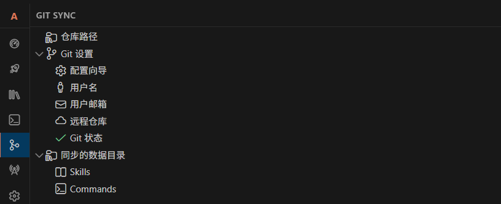
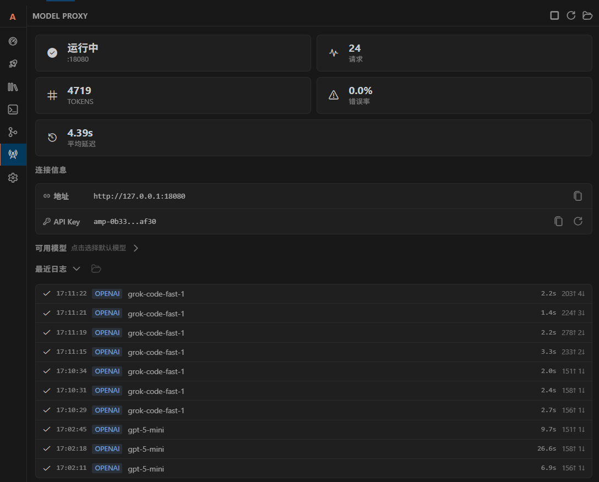
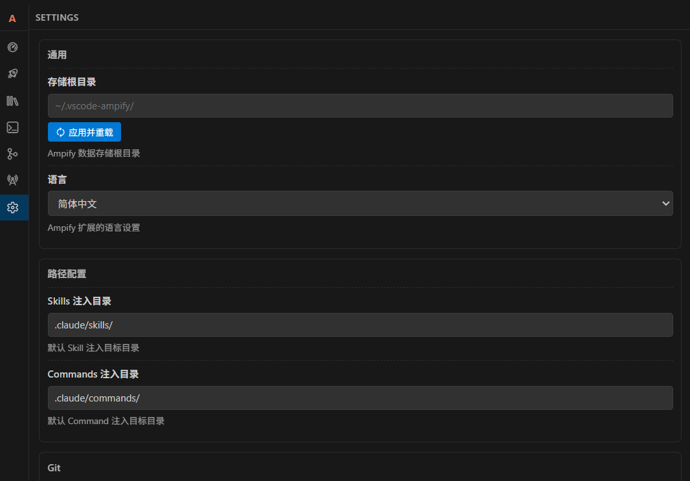

# Ampify

Ampify is a practical, all-in-one VS Code extension that helps you move faster. It unifies **path + line copying**, a **multi-account launcher**, **Skills/Commands management**, **Git Share sync**, and a **Model Proxy** in one MainView.

**v3.0.0 major update**: a full monorepo refactor with **pnpm workspaces + Turborepo**, plus **OpenCode Copilot Auth** integration, stronger instance management, and a streamlined release pipeline.

## Features

- Copy relative or absolute file paths with line ranges
- Multi-account launcher with isolated user data per instance
- Skills Manager with SKILL.md metadata, search, tag filter, preview, and inject
- Commands Manager with single-file command definitions and project injection
- Git Share sync and diff preview for skills and commands repositories
- OpenCode Copilot Auth integration with account management and quick switching
- Model Proxy: local HTTP reverse proxy (OpenAI + Anthropic compatible) with API key, model routing, instance management, and logs
- Enhanced Anthropic handler with tool integration, SSE support, and improved request serialization
- Unified MainView with sections for all modules

## What is new in v3.0.0

- **Monorepo architecture**: split into `packages/extension`, `packages/webview`, `packages/shared` for cleaner boundaries and faster builds.
- **Turborepo pipeline**: consistent build order, caching, and a single `pnpm run package` entrypoint.
- **OpenCode Auth**: manage multiple OpenCode Copilot accounts and switch per instance.
- **Improved instance keys**: safer instance isolation and clearer active account display.
- **Release stability**: branch-scoped tag queries and simplified CI pipeline.

## Screenshots


MainView overview with all modules in one place.

Skills library with search, tags, preview, and inject.

Commands library with create, preview, and apply.

Git Share sync and diff preview for skills/commands.

Local proxy with models, stats, and recent logs.

Settings panel with root directory and language.

## Usage

### Copy Path & Line

- Copy relative path + line: `Ctrl+Alt+C` (Windows/macOS)
- Copy absolute path + line: `Ctrl+Alt+V` (Windows/macOS)

### Multi-Account Launcher

- Open **Ampify** in the Activity Bar and switch to **Launcher**
- Add or edit instances, then launch with a dedicated user data directory

### Skills Manager

- Switch to **Skills** in MainView
- Create or import Skills (must include **SKILL.md** frontmatter)
- Search, filter by tag, preview, and apply skills to a workspace
- Auto-generate a hierarchical **SKILLS.md** index and reference it from **AGENTS.md**
- Skills/Commands are stored under `.agents/` by default

### Commands Manager

- Switch to **Commands** in MainView
- Create or import commands, then preview and apply to the project
- Inject target can be customized via `ampify.commands.injectTarget`

### OpenCode Copilot Auth

- Switch to **OpenCode Auth** in MainView
- Add multiple OpenCode accounts and switch the active one
- Combine with Launcher to run instances with different credentials

### Git Share

- Switch to **Git Sync** in MainView
- Sync, show changes, and manage the shared repository for skills/commands

### Model Proxy

- Switch to **Model Proxy** in MainView and start/stop the server
- Copy the **Base URL** and **API Key** from the panel
- Select a default model and monitor recent logs
- Optional: set `ampify.modelProxy.bindAddress` to `0.0.0.0` for external access

### Settings

- Update root directory or language in **Settings**, then click **Apply & Reload**

> Global data root defaults to `~/.vscode-ampify/` and can be changed via `ampify.rootDir`.

---

# Ampify（多功能实用扩展）

Ampify 是一个实用型 VS Code 扩展，将**路径行号复制**、**多账户启动器**、**技能与命令管理**、**Git Share 同步**与**模型反代**统一在一个 MainView 中。

**v3.0.0 重大更新**：完成 monorepo 重构（pnpm workspaces + Turborepo），并新增 **OpenCode Copilot Auth** 账户管理、强化实例隔离与发布流程。

## 功能

- 复制相对/绝对路径与行号范围
- 多账户启动器（独立用户数据目录）
- Skills Manager：SKILL.md 元数据、搜索、标签过滤、预览与注入
- Commands Manager：单文件命令管理与项目注入
- Git Share：统一同步与差异预览
- OpenCode Copilot Auth：多账号管理与快速切换
- Model Proxy：本地 HTTP 反代（兼容 OpenAI/Anthropic），支持实例管理、API Key、模型路由与日志
- 增强的 Anthropic 处理器：工具集成、SSE 支持与改进的请求序列化
- MainView 统一入口

## v3.0.0 重大变更亮点

- **Monorepo 架构**：拆分为 `packages/extension`、`packages/webview`、`packages/shared`，边界清晰、构建更快。
- **Turborepo 管线**：统一构建顺序与缓存，`pnpm run package` 一键完成打包。
- **OpenCode Auth**：多账户管理，支持与 Launcher 组合进行实例级切换。
- **实例隔离增强**：实例 key 管理更安全，活跃账号显示更清晰。
- **发布稳定性**：分支限定标签查询与精简 CI 流程。

## 截图


MainView 总览：统一入口与模块导航。

Skills 管理：搜索、标签过滤、预览与注入。

Commands 管理：创建、预览与应用到项目。

Git Sync：共享仓库同步与差异预览。

Model Proxy：本地反代、模型选择与日志。

Settings：根目录与语言配置。

## 使用方法

### 复制路径与行号

- 复制相对路径 + 行号：`Ctrl+Alt+C`（Windows/macOS）
- 复制绝对路径 + 行号：`Ctrl+Alt+V`（Windows/macOS）

### 多账户启动器

- 在 Activity Bar 打开 **Ampify** 并切换到 **Launcher**
- 新增或编辑实例，并以独立用户目录启动

### Skills Manager

- 切换到 **Skills**
- 创建/导入 Skills（必须包含 **SKILL.md** frontmatter）
- 搜索、标签过滤、预览并注入项目
- 自动生成层级化 **SKILLS.md** 清单，并在 **AGENTS.md** 中引用
- Skills/Commands 默认存放在 `.agents/` 目录

### Commands Manager

- 切换到 **Commands**
- 创建/导入命令并预览与注入
- 注入目标可通过 `ampify.commands.injectTarget` 自定义

### OpenCode Copilot Auth

- 切换到 **OpenCode Auth**
- 添加多个 OpenCode 账户并设置当前活跃账号
- 与 Launcher 配合，为不同实例绑定不同凭证

### Git Share

- 切换到 **Git Sync**
- 执行同步、查看差异并管理共享仓库

### Model Proxy

- 切换到 **Model Proxy** 并启动/停止代理
- 复制 **Base URL** 与 **API Key**
- 选择默认模型并查看最近日志
- 如需外网访问，可将 `ampify.modelProxy.bindAddress` 设为 `0.0.0.0`

### Settings

- 在 **Settings** 中修改根目录或语言并点击 **Apply & Reload**

> 全局数据根目录默认 `~/.vscode-ampify/`，可通过 `ampify.rootDir` 修改。

---

## Development (Monorepo)

This repository uses **pnpm workspaces + Turborepo** with three packages:

- `packages/extension` (VS Code extension)
- `packages/webview` (Vue 3 webview)
- `packages/shared` (shared protocol types)

### Install

```
pnpm install
```

### Build all packages

```
pnpm run build
```

### Lint

```
pnpm run lint
```

### Package VSIX (recommended)

```
pnpm run package
```

### Package VSIX (manual)

```
pnpm run prepackage
cd packages/extension
pnpm exec vsce package
```

---

## 开发（Monorepo）

仓库使用 **pnpm workspaces + Turborepo**，包含三个包：

- `packages/extension`（VS Code 扩展）
- `packages/webview`（Vue 3 Webview）
- `packages/shared`（共享协议类型）

### 安装依赖

```
pnpm install
```

### 构建全部包

```
pnpm run build
```

### 代码检查

```
pnpm run lint
```

### 打包 VSIX（推荐）

```
pnpm run package
```

### 打包 VSIX（手动）

```
pnpm run prepackage
cd packages/extension
pnpm exec vsce package
```