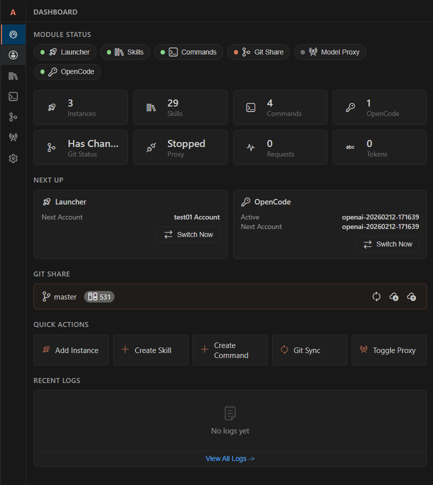
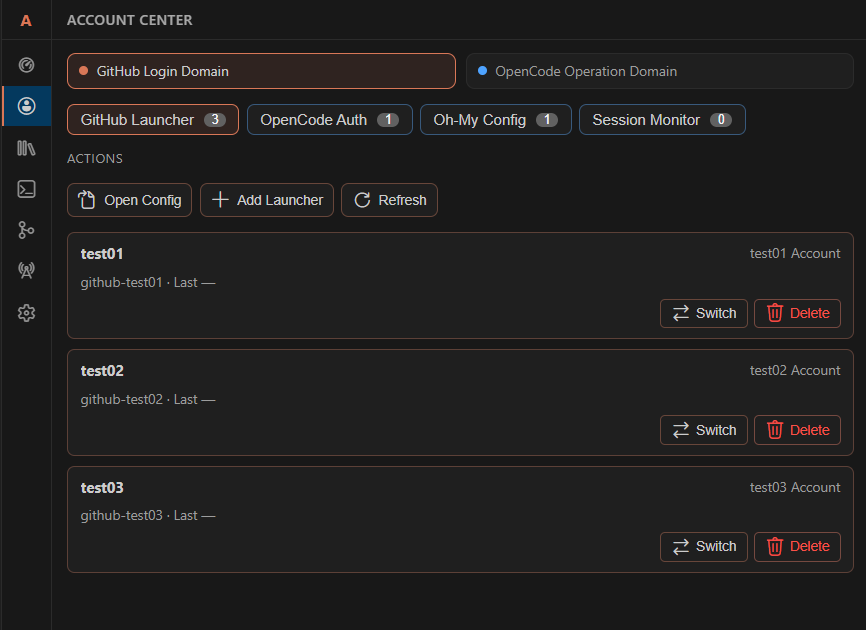
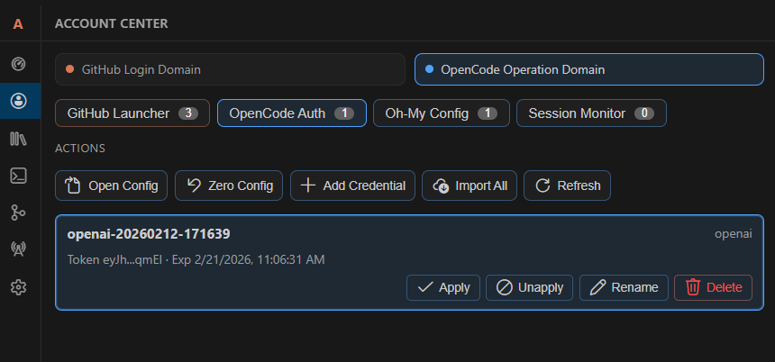
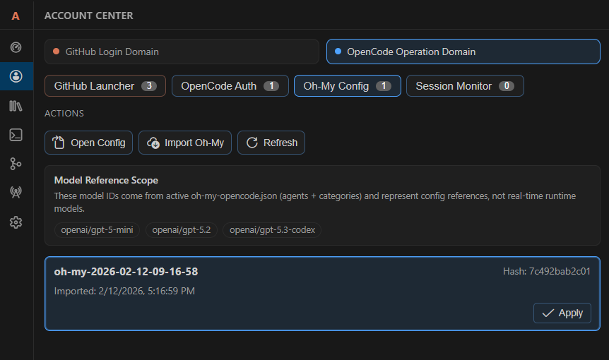
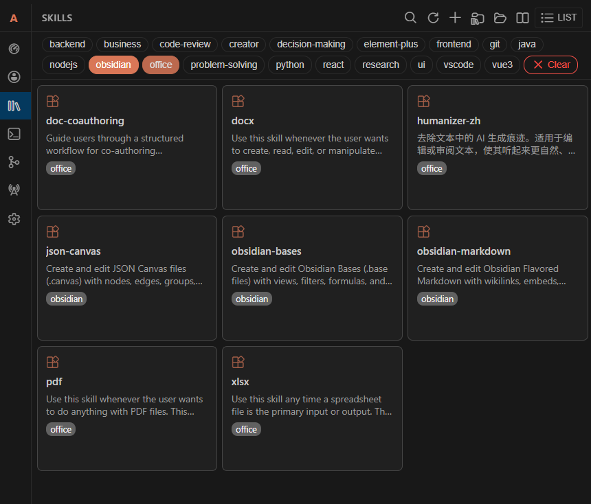
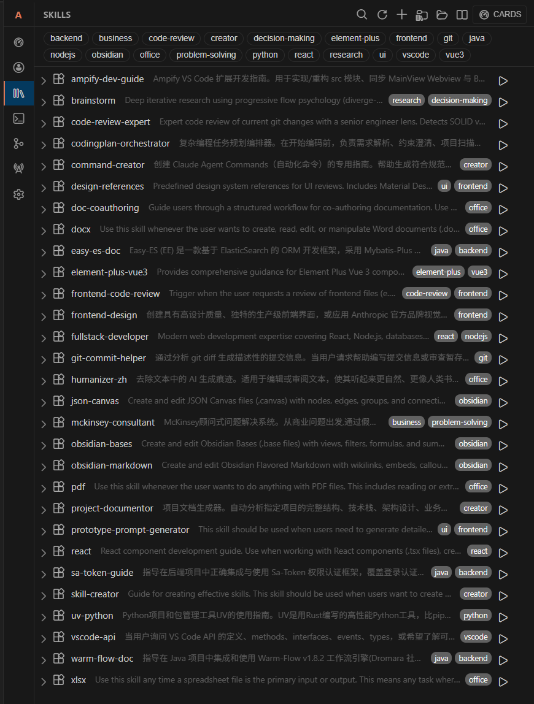
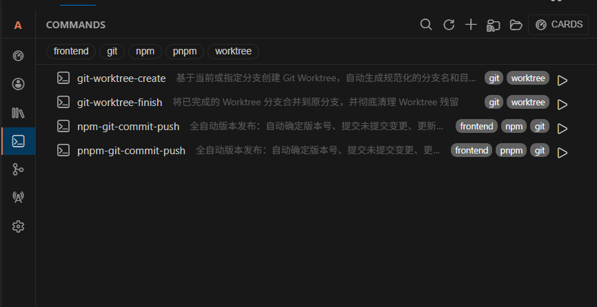
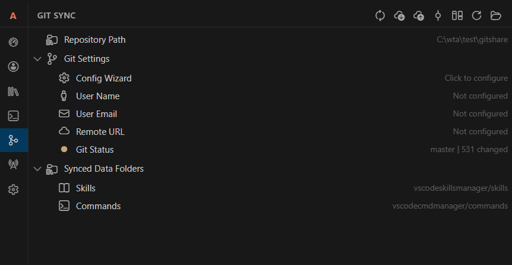
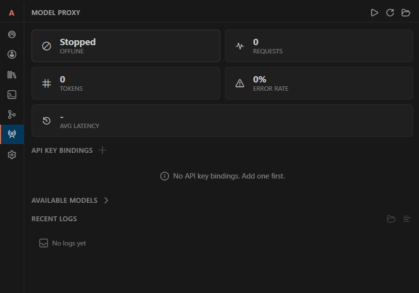
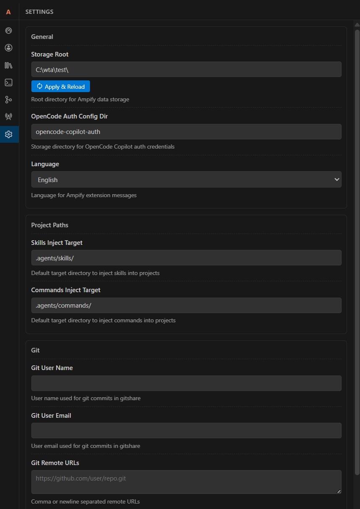

# Ampify

Ampify is an all-in-one VS Code extension for daily engineering workflows. It combines path-and-line copy, account/session tooling, Skills/Commands management, Git synchronization, and a local Model Proxy in one unified MainView.

## Language

- English first in this README.
- 简体中文请查看下半部分「中文说明」。

## What Ampify Solves

- Keep cross-tool workflow in one Activity Bar panel (`dashboard`, `accountCenter`, `skills`, `commands`, `gitshare`, `modelProxy`, `settings`)
- Reference code precisely in chat/review via copied `` `path:line` `` or `` `path:start-end` ``
- Manage reusable AI assets (Skills and Commands) with Git-backed storage and project injection
- Operate OpenCode credentials, Oh-My snapshots, and managed opencode sessions from one place
- Expose VS Code models through OpenAI/Anthropic-compatible HTTP endpoints for local integrations

## Core Modules

| Module | Purpose | Typical Actions |
|---|---|---|
| Dashboard | Health and quick actions across modules | open section, quick sync, quick import, proxy quick actions |
| Account Center | GitHub Launcher + OpenCode domain operations | switch credential, import/apply Oh-My snapshot, start/kill sessions |
| Skills Manager | Manage `SKILL.md`-based skills library | create/import/search/filter/preview/apply/sync AGENTS index |
| Commands Manager | Manage markdown command files | create/import/search/filter/preview/apply/remove |
| Git Share | Version and sync reusable assets | sync/pull/push/commit/show diff/open repo folder |
| Model Proxy | OpenAI/Anthropic-compatible local proxy | start/stop, add key binding, route model, inspect logs |
| Settings | Extension-wide runtime/storage options | set root dir, language, inject targets, proxy host/port |

## Screenshot Walkthrough (Updated)

### Main Entry



`dashboard` is the default landing section. It shows module health, quick actions, and high-signal runtime stats so you can jump to the next operation without leaving MainView.

### Account Center



Launcher tab for GitHub-domain instances. You can create and manage isolated VS Code launch profiles and switch contexts fast.



Credential tab for provider-based OpenCode auth management: add/import/rename/delete/apply/unapply credentials.



Oh-My tab for snapshot import/apply. It helps you persist and restore `oh-my-opencode.json` model/category profile sets.


Sessions tab for managed opencode sessions, with refresh/open terminal/kill lifecycle operations and provider snapshot visibility.

### Skills and Commands



Skills card view focuses on discoverability: descriptions, tags, and action buttons are optimized for browsing and quick apply.



Skills list view is optimized for dense management workflows: compact scanning, filtering, and file-level operations.



Commands manager stores one command per markdown file and supports preview/apply/remove with tag filtering.

### Git Sync, Proxy, Settings



Git Share panel for sync/pull/push/commit/diff against shared repositories that host skills and commands, with startup receive and shutdown flush recovery.



Model Proxy panel provides connection info, API key bindings, model mapping, and recent request logs for local API consumers.



Settings panel centralizes language, storage root, inject targets, and Model Proxy bind/port configuration.

## Installation

1. Open VS Code.
2. Install extension: `Ampify` (publisher: `NAMEWTA`).
3. Reload window if prompted.
4. Open Activity Bar -> **Ampify**.

## Quick Start

### Copy Path + Line

- Relative: `Ctrl+Alt+C`
- Absolute: `Ctrl+Alt+V`
- Output format: single line `` `path:line` ``, range `` `path:start-end` ``

### Account Center Flow

1. Open `accountCenter`.
2. In `auth`, import or add credentials, then apply one.
3. In `ohmy`, import/apply snapshot if needed.
4. In `sessions`, start and monitor managed opencode sessions.

### Skills / Commands Flow

1. Import or create assets in `skills` / `commands`.
2. Preview, search, and filter by tags.
3. Apply into your project target directory:
   - Skills default: `.agents/skills/`
   - Commands default: `.agents/commands/`

### Git Share Flow

1. Open `gitshare`.
2. At extension startup, Ampify auto-receives remote changes for `gitshare` (with conflict-recovery handling).
3. Run sync/pull/push/commit operations as needed.
3. Use diff preview before commit/push when needed.

### Model Proxy Flow

1. Open `modelProxy` and start service.
2. Copy Base URL / API key binding.
3. Connect any OpenAI/Anthropic-compatible client to local endpoint.

## Command Groups

### Copy

- `ampify.copy-relative-path-line`
- `ampify.copy-absolute-path-line`

### Account Center (Launcher / Auth / Oh-My / Sessions)

- Launcher: `ampify.launcher.add`, `ampify.launcher.refresh`, `ampify.launcher.editConfig`, `ampify.launcher.launch`, `ampify.launcher.switchNext`, `ampify.launcher.delete`
- OpenCode Auth: `ampify.opencodeAuth.add`, `ampify.opencodeAuth.import`, `ampify.opencodeAuth.apply`, `ampify.opencodeAuth.switch`, `ampify.opencodeAuth.switchNext`, `ampify.opencodeAuth.rename`, `ampify.opencodeAuth.delete`, `ampify.opencodeAuth.clear`, `ampify.opencodeAuth.openAuthJson`, `ampify.opencodeAuth.zeroConfig`
- Oh-My: `ampify.opencode.ohmy.import`, `ampify.opencode.ohmy.apply`, `ampify.opencode.ohmy.openConfig`
- Sessions: `ampify.opencode.session.start`, `ampify.opencode.session.open`, `ampify.opencode.session.kill`, `ampify.opencode.session.refresh`, `ampify.opencode.session.openConfig`

### Skills

- `ampify.skills.refresh`, `ampify.skills.search`, `ampify.skills.filterByTag`, `ampify.skills.clearFilter`, `ampify.skills.create`, `ampify.skills.import`, `ampify.skills.importFromUris`, `ampify.skills.apply`, `ampify.skills.preview`, `ampify.skills.openFile`, `ampify.skills.openFolder`, `ampify.skills.delete`, `ampify.skills.remove`, `ampify.skills.syncToAgentMd`

### Commands

- `ampify.commands.refresh`, `ampify.commands.search`, `ampify.commands.filterByTag`, `ampify.commands.clearFilter`, `ampify.commands.create`, `ampify.commands.import`, `ampify.commands.apply`, `ampify.commands.preview`, `ampify.commands.openFolder`, `ampify.commands.delete`, `ampify.commands.remove`

### Git Share / Model Proxy / MainView

- Git Share: `ampify.gitShare.refresh`, `ampify.gitShare.sync`, `ampify.gitShare.pull`, `ampify.gitShare.push`, `ampify.gitShare.commit`, `ampify.gitShare.showDiff`, `ampify.gitShare.editConfig`, `ampify.gitShare.openConfigWizard`, `ampify.gitShare.openFolder`
- Model Proxy: `ampify.modelProxy.toggle`, `ampify.modelProxy.start`, `ampify.modelProxy.stop`, `ampify.modelProxy.copyKey`, `ampify.modelProxy.regenerateKey`, `ampify.modelProxy.copyBaseUrl`, `ampify.modelProxy.selectModel`, `ampify.modelProxy.addBinding`, `ampify.modelProxy.removeBinding`, `ampify.modelProxy.viewLogs`, `ampify.modelProxy.refresh`
- MainView: `ampify.mainView.refresh`

## Configuration

| Key | Type | Default | Description |
|---|---|---|---|
| `ampify.language` | string | `zh-cn` | UI language (`en` or `zh-cn`) |
| `ampify.rootDir` | string | empty | Data root (`~/.vscode-ampify/` when empty) |
| `ampify.skills.injectTarget` | string | `.agents/skills/` | Skills injection target |
| `ampify.commands.injectTarget` | string | `.agents/commands/` | Commands injection target |
| `ampify.modelProxy.port` | number | `18080` | Model Proxy HTTP port |
| `ampify.modelProxy.bindAddress` | string | `127.0.0.1` | Proxy bind address (`0.0.0.0` to expose externally) |

## Data Directory

Default root is `~/.vscode-ampify/`:

```text
~/.vscode-ampify/
|- vscodemultilauncher/
|  |- config.json
|  |- userdata/
|  `- shareExtensions/
|- gitshare/
|  |- .git/
|  |- config.json
|  |- vscodeskillsmanager/
|  |  |- config.json
|  |  `- skills/<skill>/SKILL.md
|  `- vscodecmdmanager/
|     |- config.json
|     `- commands/<command>.md
|- opencode-copilot-auth/
|  `- config.json
`- modelproxy/
   |- config.json
   `- logs/*.jsonl
```

## Development

```bash
npm install
npm run compile
npm run lint
```

- Watch mode: `npm run watch`
- Extension debug: use `.vscode/launch.json` -> `调试扩展`

## Notes

- Unsaved documents cannot produce path+line output.
- Model Proxy default bind address is local only (`127.0.0.1`).
- If exposing proxy externally, secure your environment and key distribution policy first.

---

# 中文说明

Ampify 是一个面向日常工程工作的 VS Code 扩展，把路径行号复制、账户中心、Skills/Commands 管理、Git 同步与 Model Proxy 集中在一个 MainView 中。

## 核心能力

- 统一入口：`dashboard`、`accountCenter`、`skills`、`commands`、`gitshare`、`modelProxy`、`settings`
- 精准引用：复制 `` `path:line` `` 或 `` `path:start-end` ``
- 资产管理：Skills/Commands 支持搜索、标签过滤、预览、注入和 Git 同步
- 账户中心：Launcher、OpenCode Auth、Oh-My 快照、Session Monitor 一体化
- 本地代理：将 VS Code 模型以 OpenAI/Anthropic 兼容接口暴露到本地 HTTP

## 截图（已完整更新到 `docs/images-en`）

### 主入口（Dashboard）


默认首页，集中展示模块状态、快捷操作与关键统计，适合快速判断当前工作区状态并跳转到目标模块。

### 账户中心（Account Center）


GitHub Launcher 子页用于管理多实例启动配置，支持隔离用户目录与快速切换实例。


OpenCode Auth 子页用于按 provider 管理凭据，支持新增、导入、应用、取消应用、重命名与删除。


Oh-My 子页用于导入/应用 `oh-my-opencode.json` 快照，便于维护模型与分类配置方案。


Session Monitor 子页用于管理 opencode 会话生命周期，可执行刷新、打开终端、结束会话等操作。

### Skills / Commands


Skills 卡片模式强调可发现性，适合浏览技能描述、标签与操作按钮。


Skills 列表模式强调高密度管理，适合批量筛选、搜索与文件级操作。


Commands 采用单文件命令定义，支持预览、应用、移除与标签过滤。

### Git Sync / Model Proxy / Settings


Git Share 面板用于对技能与命令共享仓库执行 sync/pull/push/commit/diff 等协作操作。


Model Proxy 面板提供连接信息、API Key 绑定、模型映射与请求日志，便于本地 API 接入与排障。


Settings 面板集中管理语言、数据根目录、注入目标与 Model Proxy 端口/绑定地址配置。

## 常用命令

- 复制路径行号：`ampify.copy-relative-path-line`、`ampify.copy-absolute-path-line`
- Launcher：`ampify.launcher.*`
- OpenCode 认证：`ampify.opencodeAuth.*`
- Oh-My：`ampify.opencode.ohmy.*`
- Session：`ampify.opencode.session.*`
- Skills：`ampify.skills.*`
- Commands：`ampify.commands.*`
- Git Share：`ampify.gitShare.*`
- Model Proxy：`ampify.modelProxy.*`

## 配置项

- `ampify.language`
- `ampify.rootDir`
- `ampify.skills.injectTarget`
- `ampify.commands.injectTarget`
- `ampify.modelProxy.port`
- `ampify.modelProxy.bindAddress`

## 开发命令

```bash
npm run compile
npm run watch
npm run lint
```
